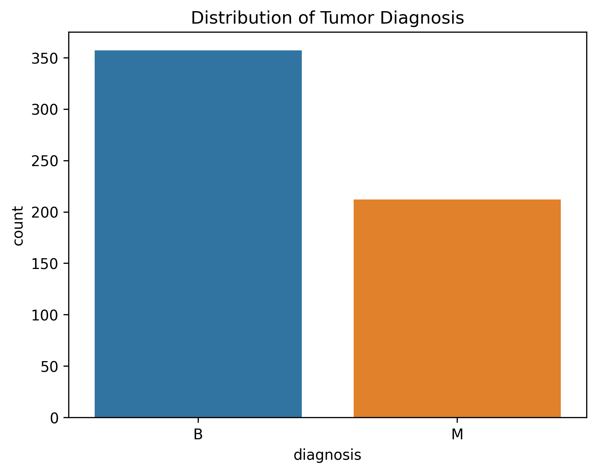
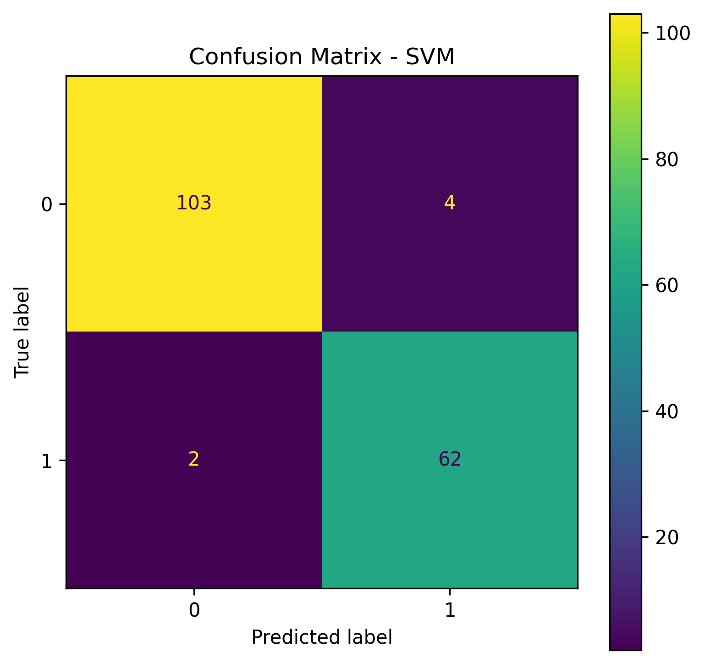

# 🩺 Breast Cancer Classification – Basic Approach
This project implements a machine learning model to predict whether a tumor is benign or malignant using the Breast Cancer dataset obtained from Kaggle.
The goal is to build a basic classification pipeline, evaluating several models and performance metrics.
---
## 📌 Contents
1. Exploratory Data Analysis (EDA)  
2. Preprocessing:  
   - Data cleaning  
   - Feature scaling  
   - Train/Test split  
3. Model training:  
   - Logistic Regression (baseline)  
   - Random Forest  
   - SVM  
   - XGBoost  
4. Evaluation metrics:  
   - Accuracy  
   - Precision  
   - Recall  
   - F1 Score  
   - ROC-AUC  
5. Visualizations:  
   - Confusion matrix  
   - ROC curve  
   - Feature importance  

---
---

## 📂 Dataset
The dataset contains features computed from digitized images of fine needle aspirate (FNA) of breast masses.

- **Target variable:** `diagnosis` (B = Benign, M = Malignant)
## 💻 Technologies used
- Python 3  
- Pandas, NumPy  
- Matplotlib, Seaborn  
- scikit-learn  
- XGBoost
## 📷 Visualizations
** Distribution diagnosis**

** Confusion Matrix**
*Random Forest Confusion Matrix*

*SVM Confusion Matrix*

*XGB Confusion Matrix*

